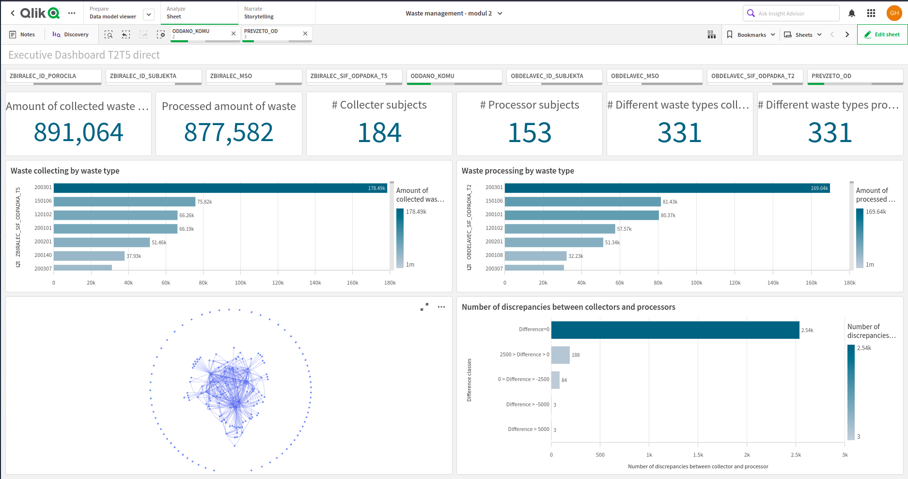
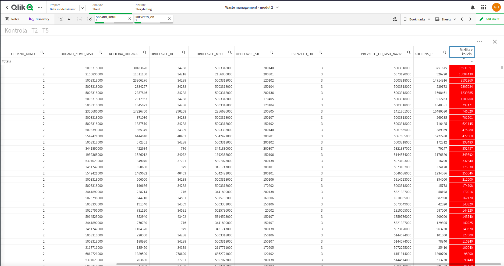

# GreenHack 2021: Waste Management 

## Introduction

The waste management chain consists of 2 crucial parts:
- waste collectors, and
- waste processors/recyclers

In the current setup, when a waste collector needs to transfer some waste from point A to point B, 
they need to fill out a form (evidencni list - EVL), which states who is transferring waste, to whom,
and how much waste is being transferred. 

Upon receiving the waste, the waste processors are obliged within a constrained time window to confirm
the received wasted, which is defined with the accompanying EVL.

The described data points are gathered and reported within the `IS-Odpadki` agency [ARSO agency](https://www.arso.gov.si/), 
which is then generating yearly reports on a waste collector and waste processor level. 

## Problem statement

The data within the `IS-Odpadki` system are not always in sync between the waste collectors
and waste processors, as we would expect them to be. The reasons for this are various, 
ranging from a simple typo when filling out the application, through discrepancies in waste measurements, 
up to malicious intent to take advantage of the systems in place.

Such malicious events lead to horrendous outcomes such as recent [dumps](https://www.delo.si/novice/okolje/nezakonito-so-odlozili-vec-kot-500-tisoc-kilogramov-odpadnega-blata/) of waste in the local forests,
which make our environment more toxic and contribute to additional acceleration of climate change, deforestation, and threatening the local animal habitat.

## Solution 

We propose a novel solution to the problem, by implementing an oracle-like system
which is monitoring the reporting of the amounts of waste being transferred in both cases.

The system has the ability to detect discrepancies within the reported data from both reporting sides.
The discrepancies are later reported to the parties involved in the following order:
1. warn the directly involed parties, i.e. waste collectors and waste processors
2. warn the authorities if no fixes are detected by the involved parties

At all times, it is keeping a strict timeline of events on who has reported what and has changed/updated what.
With this solution we provide a fair and transparent system for waste management.   

### Research 

An official guide on what the waste handling process is like can be found in the following [link](https://www.gov.si/teme/ravnanje-z-odpadki/#e62944).
As a part of the chain are the waste transporters. The list of waste transporters can be found [here](https://www.gov.si/assets/ministrstva/MOP/Dokumenti/Odpadki/Podatki/Prevozniki-odpadkov.pdf).
The waste collectors are another crucial link of the chain, a list of them can be found [here](https://www.gov.si/assets/ministrstva/MOP/Dokumenti/Odpadki/Podatki/Zbiralci-Odpadkov.pdf).
The final link of the chain are the waste processors/recycling points. The official list of approve recyclers is [here](https://www.gov.si/assets/ministrstva/MOP/Dokumenti/Odpadki/Podatki/Predelovalci-odpadkov.pdf).

Additional reports on waste management can be found [here](https://www.gov.si/assets/ministrstva/MOP/Javne-objave/Javne-obravnave/OP-odpadki/op_odpadki.pdf).
Amounts of money invested into waste management can be found [here](https://pxweb.stat.si/SiStatData/pxweb/sl/Data/-/2711809S.px/table/tableViewLayout2/).

## Dashboard (Technical) Details
The solution for detecting discrepancies between reports
generated by waste collectors and waste processors consists from two parts:
- Data processing pipeline
- Data analytics dashboard

#### Input data
- Waste collector reports exposed as Excel files, publicly available from [GreenHack official webpage](https://hackathon-tp-lj.squarespace.com/vec-o-izzivih#izziv_okolje).
- Waste processor reports exposed as Excel files  publicly available from [GreenHack official webpage](https://hackathon-tp-lj.squarespace.com/vec-o-izzivih#izziv_okolje).

#### Data processing pipeline
We developed a data processing pipeline as a Python service to perform Extraction, Transformation and Loading of the 
data into the final shape suitable for the analytics dashboard. The pipeline consists of several parts:
* Processing, verification and joining of table 5 from the collector report with table 2 from the processor report.
* Processing, verification and joining of table 5 from the collector report with table 2 from the collector report.
* Processing, verification and joining of table 4 from the processor report with table 2 from the processor report.
* Processing, verification and joining of table 4 from the processor report with table 2 from the collector report.

The processing service is located in the [repo's src](src/main.py).

#### Data analytics dashboard
To enable end users to easily explore the available data and perform discrepancy analyses we have developed an analytical application
using [QlikSense cloud](https://www.qlik.com/us/products/qlik-sense).
The application consists from two dashboards, an Executive dashboard that provides various high level KPIs and data visualization graphs for easier data understanding and exploration analyses.

The core of the application presents the dashboard that enables end users to check and control the discrepancies between amounts of waste collected and waste processed.
.

### Dashboard Demo
The analytical dashboard is publicly available at [QlikCloud tenant](https://y7re4jx3xts55u7.eu.qlikcloud.com/sense/app/85c95617-ef92-4767-8cb6-77120731060e/sheet/41807790-4e71-4a60-ab98-c08467a10fdd/state/analysis/hubUrl/%2Fexplore%2Fspaces%2Fall). 
In order to access the dashboard please login after being redirected to the login page with test account:
- email: hajduk.gojko@gmail.com
- pass: greenhack1!

Additionaly we have developed a simple web interface that exposes the graph visualizations from the Qlik Sense analytical application and shows
the abillity of the visualizatiotns being easily integrated within the preferred web page. The web interface is exposed at the [link](https://ghajduk3.github.io/greenhack2021/src/FrontEnd/table.html).
**NOTE**: Please login to the QlikCloud tenant as above described before accessing the web page.

## Utilization

We aim at integrating our solution in the existing system - `IS-Odpadki`,
and with that enable the new monitoring feature.

Simple, but very powerful.

## Roadmap

## Call to Action

